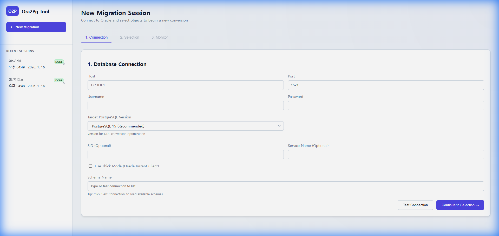
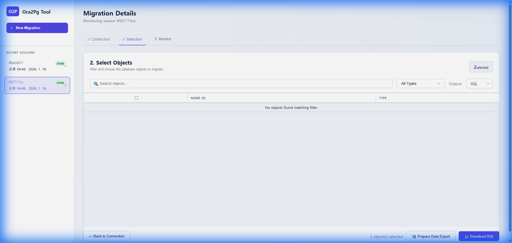
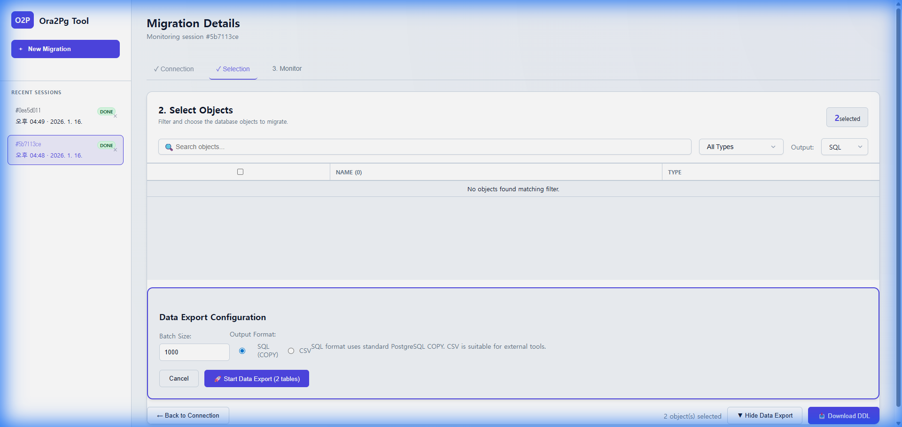
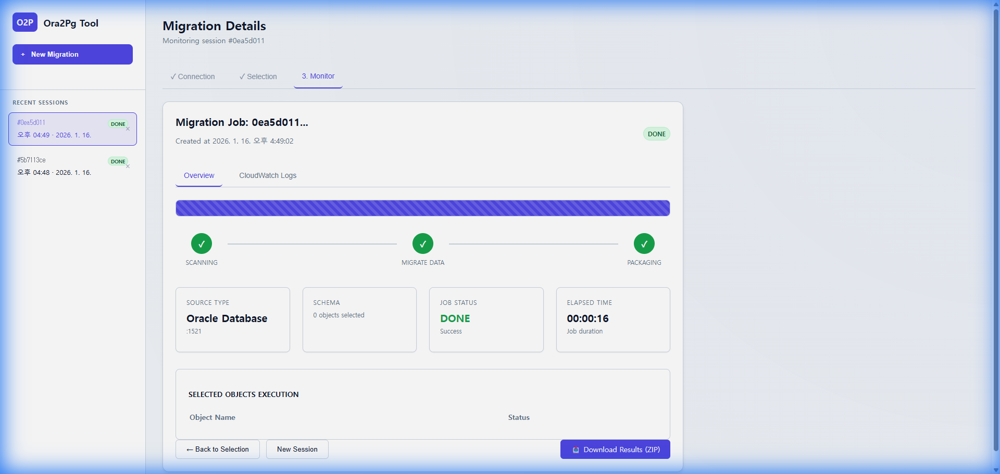

# 프로젝트 아키텍처 및 기술 가이드

이 문서는 **Ora2Pg 웹 마이그레이션 도구**에 대한 포괄적인 개요를 제공합니다. 애플리케이션 아키텍처(AA)와 기술 아키텍처(TA) 관점에서 시스템의 목적, 기술 설계, 내부 메커니즘 및 사용 방법을 다룹니다.

---

## 1. 프로젝트 개요 (AA 관점)

### 1.1 목적 및 가치 제안
데이터베이스 관리자와 개발자가 복잡한 명령줄 도구인 `ora2pg`를 직접 다루지 않고, 사용자 친화적인 웹 인터페이스를 통해 Oracle에서 PostgreSQL로의 마이그레이션을 수행할 수 있도록 지원합니다.

**핵심 목표:**
- **단순화**: `ora2pg.conf` 설정 파일을 수동으로 편집할 필요를 제거합니다.
- **접근성**: 데이터베이스 연결 테스트 및 특정 객체 선택을 위한 GUI를 제공합니다.
- **자동화**: 마이그레이션 작업 실행 및 결과 패키징을 자동화합니다.


### 1.2 사용자 워크플로우
애플리케이션은 선형적인 3단계 워크플로우를 따릅니다:

1.  **연결 설정 (Connection Setup)**: 사용자가 Oracle 데이터베이스 자격 증명(Host, Port, SID/Service, User, Password)을 입력합니다.
    
    

2.  **객체 선택 (Selection)**: 
    - 사용자가 유형별 필터링(다중 선택) 또는 이름 검색을 통해 마이그레이션할 객체를 선택합니다.
    - **DDL 다운로드**: "📥 Download DDL" 버튼을 클릭하여 스키마 변환 작업을 시작합니다.
    - **데이터 내보내기**: "📊 Prepare Data Export" 버튼을 클릭하여 데이터 내보내기 설정을 펼칩니다.

    

    **데이터 내보내기 구성**:
    - 배치 크기 및 출력 형식(SQL/CSV) 설정
    - 내보낼 테이블 선택
    - 데이터 내보내기 작업 시작

    

3.  **모니터링 (Monitor)**: 
    - 실시간 진행 상황 추적 및 로그 확인
    - 완료 시 결과 ZIP 파일 다운로드
    - 실패한 객체 재시도 옵션
    
    

---

## 2. 기술 아키텍처 (TA 관점)

### 2.1 기술 스택

| 컴포넌트 | 기술 | 선정 이유 |
|-----------|------------|-----------|
| **Frontend** | React 18, TypeScript, Vite | 현대적이고 빠르며 타입 안전성이 보장된 UI 개발 환경. |
| **Backend** | Python 3.9+, FastAPI | 고성능 비동기 API, 시스템 프로세스(Docker 등)와의 용이한 통합. |
| **Runtime** | Docker | Perl 기반의 `ora2pg` 환경을 격리하여 일관된 실행 보장. |
| **Database** | Oracle Instant Client (Backend) | Python 백엔드에서 메타데이터 검색(스키마/객체 조회)에 사용. |
| **Migration** | Ora2Pg (in Docker) | 실제 추출 작업을 수행하는 핵심 엔진. |

### 2.2 시스템 아키텍처 다이어그램

```mermaid
graph TD
    User[웹 브라우저] <-->|HTTP/JSON| Frontend[React App]
    Frontend <-->|REST API| Backend[FastAPI 서버]
    
    subgraph "Backend Services"
        Backend -->|Query Metadata| OracleService[Oracle 서비스]
        Backend -->|Dispatch| JobMgr[작업 관리자 (In-Memory)]
        JobMgr -->|Spawn| Runner[Docker 러너]
    end
    
    subgraph "Infrastructure"
        Runner -->|Docker Run| Container[Ora2Pg 컨테이너]
        Container -->|Read/Write| SharedVol[공유 작업 볼륨]
    end
    
    subgraph "External Data"
        OracleService -->|SQL*Net| OracleDB[(Oracle 데이터베이스)]
        Container -->|SQL*Net| OracleDB
    end
```

### 2.3 데이터 흐름

1.  **메타데이터 단계 (Metadata Phase)**:
    -   `OracleService` (Python)가 `oracledb` 라이브러리를 사용하여 Oracle에 직접 연결하고 테이블, 뷰 등의 목록을 조회합니다.
    -   이 단계에서는 마이그레이션이 수행되지 않으며, 메타데이터 조회만 이루어집니다.

2.  **작업 실행 단계 (Job Execution Phase)**:
    -   프론트엔드가 선택된 객체와 함께 `JobCreateRequest`를 전송합니다.
    -   `DockerRunner`가 고유 작업 공간(`backend/work/{jobId}`)을 생성합니다.
    -   객체를 유형별로 그룹화합니다 (예: 모든 TABLE, 모든 VIEW).
    -   각 그룹에 대해 임시 `ora2pg.conf` 파일을 생성합니다.
    -   `ora2pg-runner` 이미지를 `docker run`으로 실행하며 작업 공간을 마운트합니다.
    -   컨테이너의 로그를 통해 실시간 피드백을 제공합니다.

3.  **완료 단계 (Completion Phase)**:
    -   결과물(`.sql` 파일)이 작업 공간에 수집됩니다.
    -   러너가 결과물을 ZIP으로 압축합니다.
    -   프론트엔드가 API를 통해 ZIP 파일을 다운로드합니다.

---

## 3. 핵심 컴포넌트 및 로직

### 3.1 백엔드 (`backend/`)

-   **`main.py`**: 진입점. REST API 엔드포인트(`/api/*`)를 정의하고 전역 작업 상태(`jobs` 딕셔너리)를 관리합니다. 최근 업데이트로 **한글/영문 이중 주석**이 적용되었습니다.
-   **`runner.py`**: 
    -   **`DockerRunner`**: 핵심 로직 클래스.
    -   단일 작업 내 동시성 상태(취소 플래그 처리 등)를 관리하기 위해 `threading.Lock`을 사용합니다.
    -   `subprocess.Popen`을 사용하여 Docker 명령을 실행하고 로그 출력을 스트리밍합니다.
-   **`oracle_service.py`**: 직접적인 Oracle 상호작용(연결 테스트, 스키마 목록 조회)을 위한 헬퍼 클래스입니다.
-   **`models.py`**: API 요청/응답의 타입 안전성을 보장하는 Pydantic 모델입니다.

### 3.2 프론트엔드 (`frontend-app/`)

-   **`App.tsx`**: 전역 상태(페이지 라우팅, 작업 및 연결 정보)를 관리하고 하위 컴포넌트를 조율하는 메인 컨트롤러입니다. 모듈화된 컴포넌트 구조로 리팩토링되었습니다.
-   **`components/`**:
    -   **`Sidebar.tsx`**: 최근 작업 세션 기록 및 사이드바 네비게이션을 담당합니다.
    -   **`ConnectionStep.tsx`**: DB 연결 설정 입력 및 테스트 폼을 처리합니다.
    -   **`SelectionStep.tsx`**: 객체 검색, 필터링 및 선택 로직을 담당합니다.
    -   **`MonitorStep.tsx`**: 마이그레이션 진행 상황 시각화 및 로그 뷰어를 제공합니다.
    -   `Modal.tsx`: 공통 모달 컴포넌트.
    -   `Toast.tsx`: 알림 메시지 컴포넌트.
-   **`types.ts`**: `ConnectionInfo`, `JobProgress` 등 공통 인터페이스 정의.
-   **`vite.config.ts`**: 빌드 서버 구성.

### 3.3 인프라 (`infra/`)

-   **`ora2pg.Dockerfile`**: 마이그레이션 환경 정의.
    -   Perl, DBI, DBD::Oracle 및 Oracle Instant Client 라이브러리를 설치합니다.
    -   CMD 또는 Entrypoint는 `ora2pg`를 실행하도록 설정됩니다.

---

## 4. 운영 가이드

### 4.1 필수 조건
-   **Docker Desktop**: 실행 중이어야 합니다 (`ora2pg` 컨테이너 실행용).
-   **Python 3.9+**: 백엔드 API 실행용.
-   **Node.js 16+**: 프론트엔드 실행용.
-   **Oracle Instant Client** (선택사항): Thick 모드를 사용하는 경우 필요합니다.
    -   **다운로드**: [Oracle Instant Client 다운로드 페이지](https://www.oracle.com/database/technologies/instant-client/downloads.html)에서 운영체제에 맞는 버전을 다운로드합니다.
    -   **설치 방법**: 다운로드한 ZIP 파일을 원하는 위치에 압축 해제합니다.
    -   **경로 예시** (압축 해제 후 `instantclient_19_xx` 폴더까지의 전체 경로를 사용):
        -   **Windows**: `C:\oracle\instantclient_win\instantclient-basic-windows.x64-19.29.0.0.0dbru\instantclient_19_29`
        -   **Linux**: `/opt/oracle/instantclient_19_21` 또는 `/usr/lib/oracle/19.21/client64/lib`
        -   **macOS**: `/usr/local/lib/instantclient_19_21`
    -   **필수 파일 확인** (위 경로 내에 다음 파일이 있어야 함):
        -   Windows: `oci.dll`
        -   Linux: `libclntsh.so`
        -   macOS: `libclntsh.dylib`

### 4.2 설정 및 실행

**1단계: Oracle Instant Client 설정 (Thick 모드 사용 시)**
Thick 모드를 사용하려는 경우, Oracle Instant Client를 설치하고 경로를 확인합니다.

```bash
# Windows 예시 - 압축 해제한 instantclient_19_xx 폴더의 전체 경로 사용
dir C:\oracle\instantclient_win\instantclient-basic-windows.x64-19.29.0.0.0dbru\instantclient_19_29\oci.dll

# Linux 예시
ls /opt/oracle/instantclient_19_21/libclntsh.so

# macOS 예시
ls /usr/local/lib/instantclient_19_21/libclntsh.dylib
```

> [!TIP]
> 애플리케이션의 연결 설정 화면에서 "Use Thick Mode" 체크박스를 선택하면, 라이브러리 경로 입력 필드가 나타납니다. 위에서 확인한 `instantclient_19_xx` 폴더의 **전체 경로**를 입력하세요.

> [!NOTE]
> Thick 모드는 선택사항입니다. 대부분의 경우 기본 Thin 모드로 충분합니다. Thick 모드는 특정 Oracle 기능(예: Advanced Queuing, LDAP 인증)이 필요한 경우에만 사용하세요.

**2단계: Docker 이미지 빌드**
실제 마이그레이션 러너를 위해 필요합니다.
```bash
cd infra
docker build -t ora2pg-runner -f ora2pg.Dockerfile .
```

**3단계: 백엔드 시작**
```bash
cd backend
pip install -r requirements.txt
uvicorn main:app --reload --port 8000
```

**4단계: 프론트엔드 시작**
```bash
cd frontend-app
npm install
npm run dev
```
브라우저에서 `http://localhost:5173`으로 접속합니다.

---

## 5. 보안 및 확장성

### 5.1 보안 고려사항
-   **자격 증명**:
    -   HTTPS를 통해 프론트엔드에서 백엔드로 전송되어야 합니다 (운영 환경 권장).
    -   실행 중에는 메모리(`jobs` 딕셔너리)에 저장됩니다.
    -   `backend/work/{jobId}` 내부의 임시 파일 `ora2pg.conf`에 기록됩니다.
    -   *완화책*: `work` 디렉토리는 암호화된 볼륨이나 임시 저장소를 사용해야 합니다.

### 5.2 확장성 및 지속성
-   **현재 상태**:
    -   **상태**: In-Memory (`jobs` 딕셔너리). 백엔드 재시작 시 작업 기록이 소실됩니다.
    -   **동시성**: Python 스레드(`BackgroundTasks`)를 사용합니다. CPU 부하가 큰 작업은 Docker로 오프로드되지만, Python 프로세스가 서브프로세스를 관리합니다.
-   **미래 확장**:
    -   **지속성**: In-Memory 딕셔너리를 SQLite/PostgreSQL 데이터베이스로 대체.
    -   **큐잉**: `BackgroundTasks` 대신 Celery/Redis를 사용하여 작업자(Worker)의 수평적 확장을 지원.
    -   **저장소**: 다중 서버 배포 시 로컬 디스크 대신 S3 또는 공유 NFS 사용.

---

## 6. 디렉토리 구조 개요

```text
/
├── backend/            # Python API 서버
│   ├── main.py         # 라우트 및 앱 진입점
│   ├── runner.py       # 작업 조율 로직
│   ├── work/           # 실행 중인 작업을 위한 임시 저장소 (GITIGNORED)
│   └── ...
├── frontend-app/       # React 애플리케이션
│   ├── src/
│   │   ├── App.tsx     # 메인 컨트롤러
│   │   ├── types.ts    # 공통 타입 정의
│   │   └── components/ # UI 컴포넌트 (Sidebar, Steps 등)
│   └── ...
├── infra/              # DevOps 및 Docker
│   ├── ora2pg.Dockerfile # 이미지 정의
│   └── ...
└── README.md           # 빠른 시작
```
